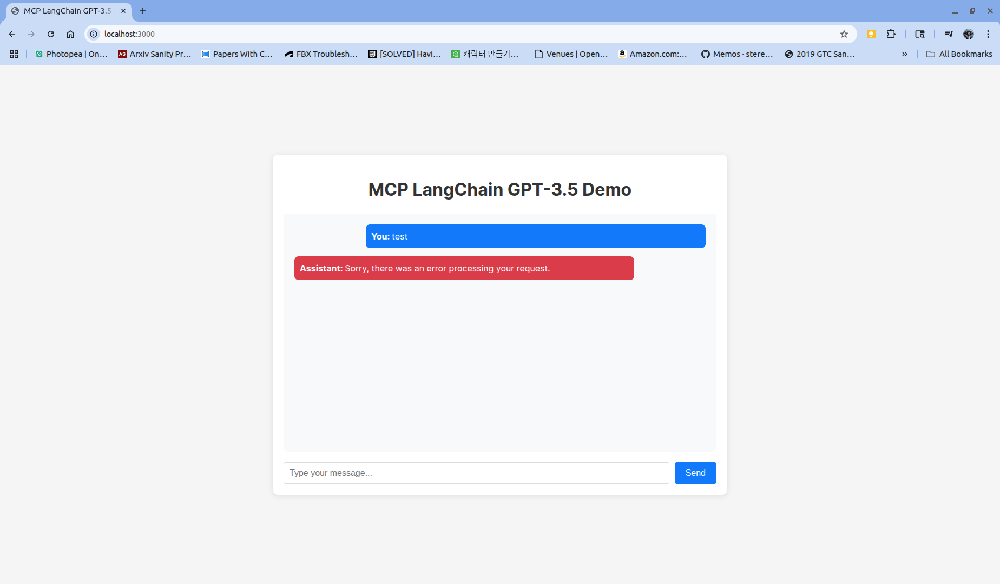

# MCP LangChain GPT-3.5 Web Demo

This is a web-based implementation of the MCP (Machine Conversation Protocol) using LangChain.js and OpenAI's GPT-3.5 model. The application provides a simple chat interface for interacting with the AI model.



## Features

- Real-time chat interface
- Integration with OpenAI's GPT-3.5 model via LangChain
- Responsive design
- Error handling and loading states

## Prerequisites

- Node.js (v14 or higher)
- npm or yarn
- OpenAI API key

## Setup

1. Clone the repository and navigate to this directory:
   ```bash
   cd langchain-gpt35-web
   ```

2. Install dependencies:
   ```bash
   npm install
   ```

3. Create a `.env` file in the root directory and add your OpenAI API key:
   ```
   OPENAI_API_KEY=your_api_key_here
   ```

4. Start the development server:
   ```bash
   npm run dev
   ```

5. Open your browser and navigate to `http://localhost:3000`

## Usage

1. Type your message in the input field
2. Press Enter or click the Send button
3. Wait for the AI's response
4. Continue the conversation as needed

## Building for Production

To create a production build:

```bash
npm run build
```

The built files will be in the `dist` directory.

## Technologies Used

- React
- LangChain.js
- OpenAI GPT-3.5
- Vite