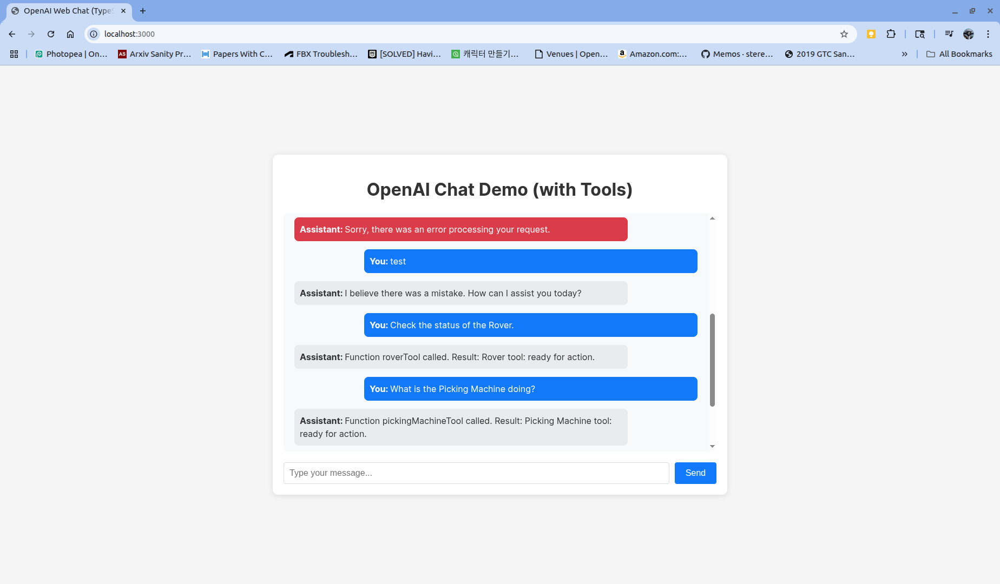

# OpenAI Web Chat (TypeScript)

A TypeScript implementation of a web-based chat interface using OpenAI's API directly. This version includes type safety and modern React practices.



- Try asking the chat things like:
  - "Check the status of the Rover."
  - "What is the Picking Machine doing?"
  - "Is the Processing Machine ready?"

## Features

- TypeScript support for better type safety
- Real-time chat interface
- Direct integration with OpenAI's API
- Responsive design
- Error handling and loading states
- Modern React with hooks

## Prerequisites

- Node.js (v14 or higher)
- npm or yarn
- OpenAI API key

## Setup

1. Clone the repository and navigate to this directory:
   ```bash
   cd openai-web-ts
   ```

2. Install dependencies:
   ```bash
   npm install
   ```

3. Create a `.env` file in the root directory and add your OpenAI API key:
   ```
   VITE_OPENAI_API_KEY=your_api_key_here
   ```

4. Start the development server:
   ```bash
   npm run dev
   ```

5. Open your browser and navigate to `http://localhost:3000`

## Development

The project uses TypeScript for type safety and better development experience. Key features:

- Type definitions for all components and functions
- Strict type checking
- Modern React patterns with hooks
- Vite for fast development and building

## Security Note

This example uses the OpenAI API directly from the browser for simplicity. In a production environment, you should:

1. Create a backend service to handle API calls
2. Never expose your API key in the frontend
3. Implement proper rate limiting and error handling

## Building for Production

To create a production build:

```bash
npm run build
```

The built files will be in the `dist` directory.

## Technologies Used

- TypeScript
- React
- OpenAI API
- Vite